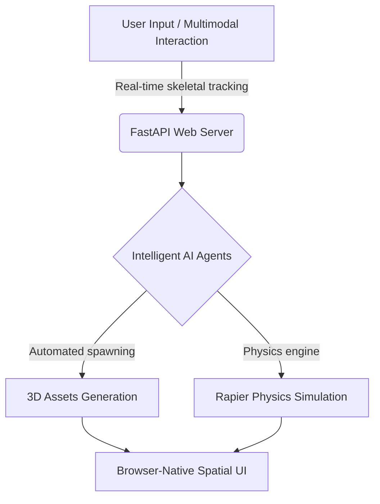
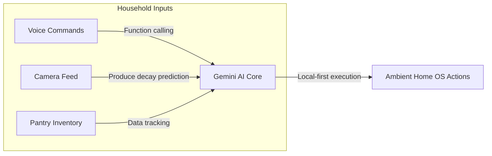

<div align="center">
  <!-- Exact Spider-Man Header Banner matching your custom city skyline graphic -->
  
</div>

<h3 align="center">🕸️ Aspiring AI Engineer | Generative AI & Data Science 🕸️</h3>

<p align="center">
  <a href="https://github.com/AMITH2529">
    
  </a>
</p>

---

### 🕷️ My Origin Story

I am an AI & Machine Learning student with a strong interest in building intelligent AI applications. My "Spidey-Sense" tingles most when I'm working with Generative AI, NLP, and Deep Learning. Having completed an intensive Gen AI & Data Science Bootcamp, I build real-world AI systems, including RAG pipelines, chatbots, and prediction models.

*   🌍 **Multiversal Communicator:** Fluent in English, Kannada, Telugu, Hindi, and Tamil.
*   🎓 **Training at the Sanctum:** Currently pursuing a B.E. in Artificial Intelligence & Machine Learning at The Oxford College of Engineering, Bangalore.
*   🕸️ **Web-Shooter Tech:** Skilled in PyTorch, LangChain, FastAPI, and building Agentic AI.

---

### 🛠️ The Web-Slinger's Utility Belt

**Languages, Frameworks & Toolkits (My Spidey-Sense)**
<br>
<p align="left">
  <a href="https://skillicons.dev">
    
  </a>
</p>

---

### 🏙️ Saving the City (Featured Projects)

#### 🛡️ A.E.G.I.S. (AI Driven Spatial Systems)
A browser-native generative spatial computing system enabling multimodal interaction and decentralized 3D environmental interaction. It utilizes real-time skeletal hand tracking, FastAPI web sockets, Rapier physics, and intelligent AI agents for the automated spawning of 3D assets.



#### 🏠 HOMEOPS-AI
An elegant, local-first ambient home operating system powered by Gemini AI. It acts as a digital butler to manage pantry inventory, predict produce decay via camera, automate chores using voice function calling, and track household data.



#### 🎵 Mood Playlist Generator
A Python-based application designed to dynamically generate playlists based on emotional sentiment and mood.

---

### 🕷️ Web-Slinger Activity (Contributions)

<div align="center">
  <!-- This image will be generated automatically by the Spider GitHub Action -->
  <picture>
    <source media="(prefers-color-scheme: dark)" srcset="https://raw.githubusercontent.com/AMITH2529/AMITH2529/output/github-contribution-grid-spider-dark.svg">
    <source media="(prefers-color-scheme: light)" srcset="https://raw.githubusercontent.com/AMITH2529/AMITH2529/output/github-contribution-grid-spider.svg">
    
  </picture>
</div>

<br>

<div align="center">
  <!-- Spidey themed github stats card -->
  
  
  <!-- Spidey themed streak stats card -->
  
</div>

<br>

<br>

<details>
<summary><b>💻 Click to Initialize Spidey-Sense Terminal Console</b></summary>

```bash
$ init-spidey-sense --user=AMITH2529
[INFO] Initializing web-shooters... OK
[INFO] Loading Multiversal Languages [English, Kannada, Telugu, Hindi, Tamil]... Loaded
[INFO] Connecting to A.E.G.I.S. Spatial Systems... Connected
[INFO] Booting HOMEOPS-AI Local Butler... Online
>>> "With great code comes great responsibility."
>>> Status: Ready to deploy intelligent AI applications.
```
</details>

<br>

<div align="center">
  <!-- Capsule wavy footer -->
  
</div>
